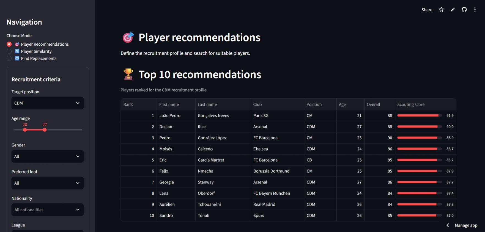
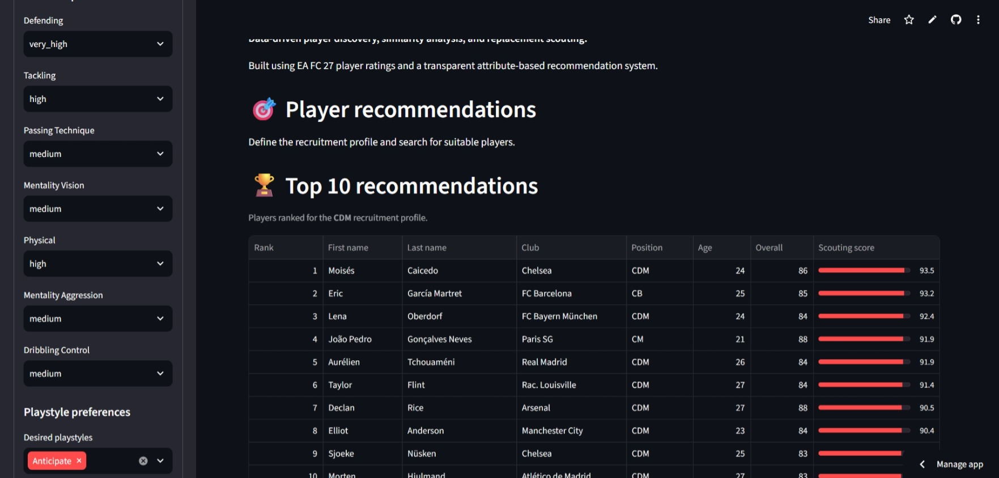
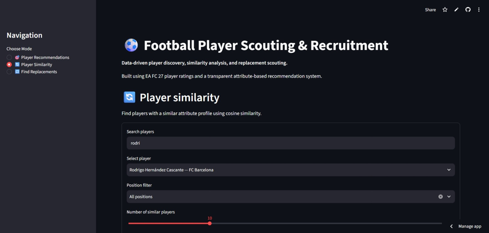
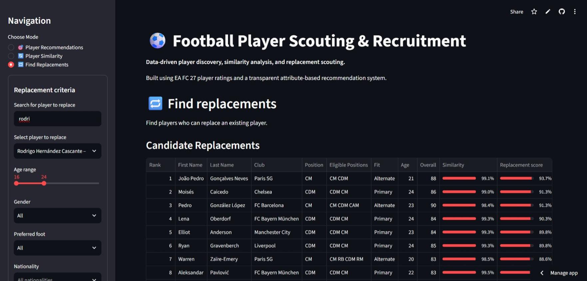
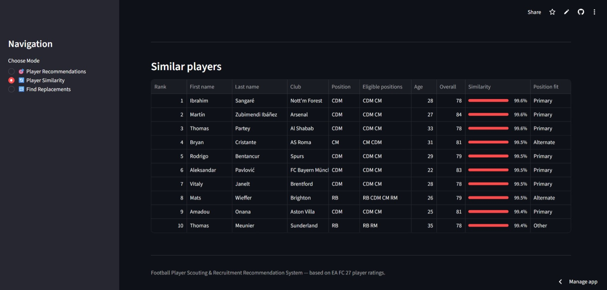

# ⚽ Football Player Scouting & Recruitment Recommendation System

A configurable football scouting and recruitment recommendation system built with Python and Streamlit.

The project uses **EA SPORTS FC 27 player ratings** to simulate common scouting workflows: finding players who fit a recruitment profile, identifying players with similar attribute profiles, and finding potential replacements for a target player.

The system goes beyond a single overall rating by using **position-specific abilities, recruitment priorities, player characteristics, playstyles, and similarity** to produce transparent player rankings.

> **Note:** This is a portfolio project based on FC 27 in-game ratings. It is not intended to represent real-world player quality or professional scouting decisions.

---

## 🎯 Project Objective

Traditional football game ratings provide players with a single overall rating, but recruitment decisions often depend on the specific requirements of a position and team.

For example, a club looking for a defensive midfielder may prioritize:

- Defending
- Tackling
- Passing
- Vision
- Physicality

while another club may prioritize technical ability, ball progression, or creativity.

This project therefore builds a **configurable scouting framework** where player suitability depends on the recruitment profile rather than simply selecting players with the highest overall rating.

---

## 🖥️ Application

The Streamlit application provides three main scouting workflows.

###  🎯 Player Recommendations

Find players who match a defined recruitment profile.

The user can specify:

- Target position
- Age range
- Gender
- Preferred foot
- Nationality
- League
- Club
- Attribute priorities
- Desired PlayStyles
- Number of recommendations

The system then filters eligible players and ranks them using a position-specific scoring model.

---

### 🔄 Player Similarity

Find players with similar attribute profiles to a selected player.

The system uses **cosine similarity** across normalized scouting abilities.

For example:

> Find players whose attribute profile is similar to a selected CDM.

Similarity measures how similar the players are in terms of their attributes. It does **not** mean that the players have equal quality or overall rating.

---

### 🔁 Find Replacements

Find potential replacements for a selected player while applying recruitment constraints.

For example:

> Find a younger CDM who can replace a selected player while matching the club's desired attributes and PlayStyles.

The system:

1. Identifies players eligible for the target position
2. Applies recruitment constraints
3. Excludes the selected player
4. Calculates a recruitment profile score
5. Calculates attribute-profile similarity
6. Incorporates optional PlayStyle matching
7. Produces a ranked list of replacement candidates

---

## 🧠 System Overview

```text
                    FC27 Player Dataset
                            │
                            ▼
                    Data Preprocessing
                            │
                            ▼
                    Feature Engineering
                            │
              ┌─────────────┼─────────────┐
              │             │             │
              ▼             ▼             ▼
       Recommendation    Similarity    Replacement
          System           System         System
              │             │             │
              └─────────────┼─────────────┘
                            ▼
                     Ranked Players
                            │
                            ▼
                    Streamlit Interface
```

## 🧩 Feature Engineering

The original FC 27 dataset contains many highly correlated attributes.

Using every correlated attribute independently can cause some abilities to be effectively counted multiple times.

For example:

Acceleration and Sprint Speed are strongly related.
Skill Dribbling and Ball Control are strongly related.
Defensive Awareness and Interceptions are strongly related.
Standing and Sliding Tackles are strongly related.

To reduce this double-counting, related attributes are grouped into broader scouting abilities.

Ability Groups
Scouting Ability	Attributes
Pace	Acceleration + Sprint Speed
Dribbling & Control	Skill Dribbling + Ball Control
Agility	Agility + Balance
Passing Technique	Short Passing + Long Passing
Shooting Power	Shot Power + Long Shots
Defending	Interceptions + Defensive Awareness
Tackling	Standing Tackle + Sliding Tackle
Aerial	Heading Accuracy + Jumping
Physical	Strength + Stamina
Goalkeeping	Diving + Handling + Kicking + Positioning + Reflexes

Other attributes are retained individually when they represent distinct scouting characteristics, such as:

Finishing
Crossing
Vision
Positioning
Composure
Reactions
Skill Moves
Weak Foot
Aggression
Penalties
Curve
Free Kick Accuracy

The original attributes are retained so that recommendations can be explained in detail.

###⚽ Position-Specific Scoring

Different positions require different player profiles.

The system therefore uses separate attribute weights for each position.

Examples:

CDM

Emphasizes:

Defending
Tackling
Passing Technique
Vision
Physicality
Aggression
Dribbling & Control
CM

Emphasizes:

Passing Technique
Vision
Dribbling & Control
Defending
Tackling
Shooting
Finishing
CAM

Emphasizes:

Dribbling & Control
Vision
Skill Moves
Finishing
Passing
Shooting Power
Positioning
ST

Emphasizes:

Finishing
Shooting Power
Positioning
Aerial ability
Dribbling & Control
Pace
Physicality

Defensive and wide positions use their own position-specific profiles as well.

The weights are transparent, configurable heuristics. They are not learned from EA's overall rating.

### 🎚️ Recruitment Priorities

Users can modify the importance of individual abilities.

Each ability can receive a priority such as:

Very Low
Low
Medium
High
Very High

The priority modifies the base position-specific weights before the final player score is calculated.

This allows the same position to produce different recommendations depending on the club's recruitment philosophy.

For example:

CDM Recruitment Profile

Defending       → Very High
Tackling        → Very High
Passing         → High
Vision          → High
Physicality     → Medium

Changing these priorities changes the resulting player ranking.

### 🎮 PlayStyle Matching

PlayStyles are treated as an additional recruitment signal rather than a hard requirement.

The system distinguishes between the normal and enhanced versions of a PlayStyle:

Match	Score
PlayStyle+	1.00
Base PlayStyle	0.75
Not present	0.00

The PlayStyle score contributes a small bonus to the final recommendation.

This means that a player with an excellent attribute profile is not automatically discarded simply because they do not possess a requested PlayStyle.

### 🔄 Replacement Scoring

Replacement scouting combines two ideas:

1. Recruitment Profile

How well the player fits the requested position and recruitment priorities.

2. Attribute Similarity

How similar the player's normalized attribute profile is to the target player.

The replacement system combines these signals to rank candidates.

The current weighting gives greater importance to the recruitment profile while still using similarity as an additional signal.

Important: A high similarity score means that two players have similar attribute profiles. It does not mean that they have the same overall rating, quality, market value, or real-world ability.

## 📊 Exploratory Analysis

The project also contains exploratory analysis of the FC 27 dataset.

The notebooks investigate:

Player and position distributions
Attribute distributions
Correlations between attributes
Position-specific characteristics
Position classification
Permutation importance
SHAP analysis

The position classification model is used as an exploratory analysis tool to investigate which attributes distinguish positions.

It is not used as the final player recommendation model.

## 🧪 Evaluation

There is no ground-truth dataset indicating which player is objectively the correct recruitment choice.

Therefore, traditional supervised-learning accuracy is not an appropriate evaluation metric for the final recommendation system.

Instead, the system was tested for behavioral consistency.

Tests include:

Position constraints are respected
Age constraints are respected
Gender filters are respected
Preferred-foot filters are respected
Nationality filters are respected
League filters are respected
Club filters are respected
Target players are excluded from replacement results
Increasing an attribute priority changes rankings accordingly
Requested PlayStyles affect the PlayStyle score
overall_rating does not directly determine the custom recommendation score
Similarity rankings are based on normalized scouting attributes

## 📁 Dataset

The project uses a snapshot of 19,789 EA SPORTS FC 27 players.

The dataset contains:

Player information
Club and league
Position and alternate positions
Nationality
Gender
Preferred foot
Skill Moves and Weak Foot
Birthdate
PlayStyles
Six main attribute categories
Detailed player attributes
Goalkeeping attributes

The original raw dataset is stored in:

Data/players.csv

The cleaned dataset used by the application is:

Data/players_cleaned.csv

Dataset documentation and attribution are preserved in:

Data/DATASET_README.md

The dataset is an unofficial snapshot of EA's public ratings data and is used for analysis and educational purposes.

## 🏗️ Project Structure
```text football-player-scouting/
│
├── Data/
│   ├── players.csv
│   ├── players_cleaned.csv
│   └── DATASET_README.md
│
├── Notebooks/
│   ├── 01_data_cleaning_eda.ipynb
│   ├── 02_position_analysis.ipynb
│   ├── 03_recommendation_system.ipynb
│   └── 04_similarity_replacement.ipynb
│
├── src/
│   ├── __init__.py
│   ├── preprocessing.py
│   ├── features.py
│   ├── recommendation.py
│   ├── scoring.py
│   └── similarity.py
│
├── app.py
├── requirements.txt
├── .gitignore
└── README.md
```

## 🛠️ Tech Stack
Programming
Python
Data Processing
Pandas
NumPy
Machine Learning
Scikit-learn
Cosine similarity
Feature normalization
Data Visualization
Matplotlib
Seaborn
Application
Streamlit
 
## 🚀 Installation & Usage
1. Clone the repository
git clone https://github.com/mouhbnms/football-player-scouting.git
cd football-player-scouting
2. Create a virtual environment
Windows
python -m venv .venv
.venv\Scripts\activate
macOS / Linux
python3 -m venv .venv
source .venv/bin/activate
3. Install dependencies
pip install -r requirements.txt
4. Run the application
streamlit run app.py

The application will open in your browser.

## 🖥️ Application Preview

Screenshots of the deployed application will be added here.

Player Recommendations




Player Similarity



Find Replacements




## 🚀 Live Demo

👉 **[Try the application](https://football-player-scouting-m.streamlit.app/)**


## ⚠️ Limitations
Dataset

The system uses FC 27 in-game ratings, not real-world performance data.

The recommendations should therefore be interpreted as recommendations based on the game's player attributes rather than objective real-world scouting conclusions.

Recommendation Weights

Position weights are domain-informed heuristics.

They are not learned from:

Historical transfers
Professional scouting reports
Match performance
Transfer success
Club recruitment outcomes
Similarity

Cosine similarity measures similarity between attribute profiles.

A player with 99% similarity to another player does not necessarily have the same quality or overall rating.

Market Value

The current system does not include:

Transfer value
Salary
Contract length
Release clauses
Transfer availability
Static Dataset

The project uses a fixed FC 27 snapshot rather than a live player database.

## 🔮 Future Improvements

Possible future extensions include:

Market value integration
Value-for-money scouting
Learned scouting weights from historical outcomes
Historical player snapshots
Player development trajectories
Richer tactical profiles
Additional recruitment constraints
Integration of real-world performance statistics
More advanced Streamlit visualizations

## 👨‍💻 Author

Mohamed Benmoussa

Master's graduate in Intelligent Computer Systems.

Focused on Data Science, Machine Learning, and Applied AI.

## 📄 Dataset Attribution

The FC 27 player dataset used in this project originates from the ea-fc-player-stats project and is based on data from EA's public ratings API.

The original dataset documentation, source information, and legal notice are preserved in:

Data/DATASET_README.md

All player data and names belong to Electronic Arts.

This project is an unofficial, non-commercial project intended for analysis and educational purposes.
